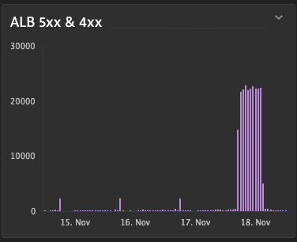

## (Optional) Application Load Balancer

Display 4xx and 5xx errors seen by the Application Load Balancer (ALB)​

1. Select on the left Menu "Data explorer"​
2. On the top right corner, select the chart as "Graph"​
3. On the metric selection type "ALB number of 5XX errors"​
4. Leave aggregation as Auto(avg)​
5. Split by "Application load balancer"​
6. Add a second metric​
7. On the metric selection type "ALB number of 4XX errors"​
8. Leave aggregation as Auto(avg)​
9. Split by "Application load balancer"​
10. Click on "Run query" button​
11. Click on "Pin to Dashboard" button and add it to your dashboard "AWS overview"​
