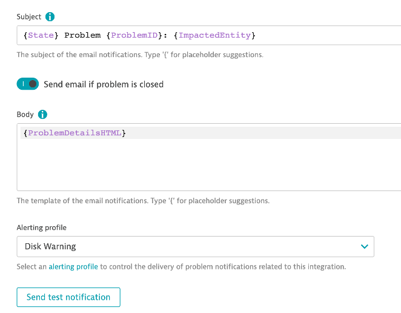

## Email Alert

- Now that we’ve created an Alerting Profile (filtered/grouped the alerts), let’s tell Dynatrace what to do when that triggers.

### Exercise Steps

1. Navigated to Settings > Integration > Problem Notifications
2. Add notification
* Notification type: Email
* Display Name: Disk Warning
* To: Your Email Address
* Alerting Profile: Disk Warning
* Save Changes
3. Send test notification

