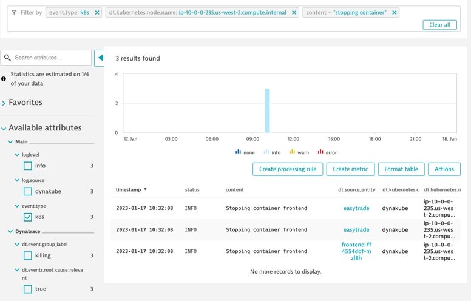

## Charting Events

### Exercise Steps

1. Navigate to the Logs & Events Viewer​
2. Filter by event.type: k8s​
```bash
event.type: k8s​
```
3. Click into an event entry to see what attributes are captured​
4. Add a filter for our node​
```bash
dt.kubernetes.node.name: NODE_NAME
```
5. Filter the content for Stopping Container events​
```bash
content: stopping container
```
6. Format the table by adding the fields below:​
* dt.source_entity​
* dt.kubernetes.node.name​
* dt.kubernetes.cluster.name​

7. Pin the table to your dashboard


