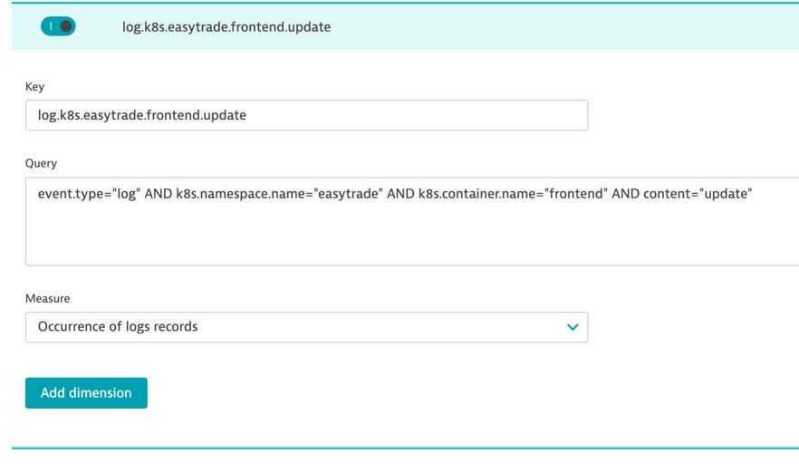

## Logs Metrics



### Exercise Steps

1. Click Create Metric
2. Make your metric key descriptive
```bash
log.k8s.easytrade.frontend.update​
```
3. Click save changes​
* This metric can now be used in a Metic Event alert or on a chart
