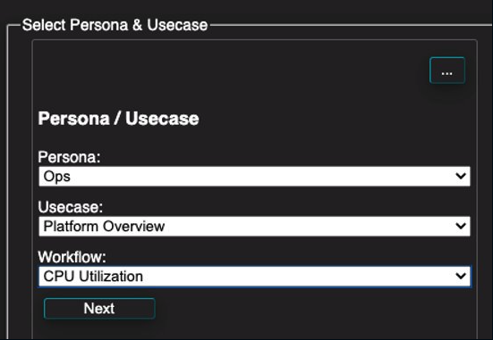

## Dashboard Creation 

### Exercise Steps

1. Navigate to https://dynatrace.github.io/BizOpsConfigurator 
2. Enter your tenant URL and API Token

* Deploy Persona Ops: Platform Overview, CPU Utilization (no diamond)
* Deploy Persona Ops: Platform Overview, Disk Utilization (no diamond)
* Deploy Persona Ops: Platform Overview, Memory Utilization (no diamond)
* Deploy Persona Ops: Platform Overview, Network Observability (no diamond)

3. Navigate back to the Dynatrace UI and see the new dashboards!
