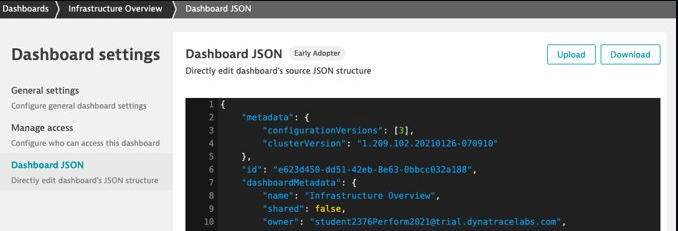

## Dashboard Export 

### Exercise Steps

### How can I bring my dasboard home with me? 

1. Navigate to Dashboards > "Cloud Infrastructure Overview" dashboard 
2. Click ... Button in upper right corner > Share > Advanced Settings
3. Click dashboard JSON > Download
4. This is also available in the Configuration API for managing dashboards at scale
